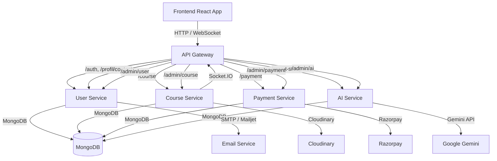

# Academix

## Project Overview

Academix is a full-stack learning platform built as a React frontend and a Node.js backend that uses a microservices architecture. The backend is organized into separate services for authentication, course management, payments, AI study assistance, and an API gateway. The frontend connects to the backend through the gateway and provides student, instructor, and admin experiences.

## Live Demo

Visit the deployed site: https://academix-sigma.vercel.app/

## Repository Structure

- `backend/`
  - `api-gateway/` — routes frontend requests to the appropriate microservice and handles Socket.IO proxying
  - `user-service/` — user authentication, profile management, password reset, contact form, and admin user workflows
  - `course-service/` — course creation, sections, lessons, ratings/reviews, and real-time course updates
  - `payment-service/` — payment capture, verification, refund management, and payment-related admin operations
  - `ai-service/` — AI-driven study features including summaries, document chat, doubt answering, and text-to-video conversion
  - `shared-utils/` — shared utilities, validation, mailing, queue workers, and common middleware
- `frontend/` — React app with routes, dashboard UX, course views, admin pages, and AI integrations

## Key Features

- Microservices backend with centralized API Gateway
- Auth0 plus custom JWT authentication
- Course and instructor management flows
- Payment processing via Razorpay
- AI-powered study tools and document interaction
- Admin dashboards for users, courses, and refunds
- Socket.IO support for real-time interactions

## System Design Diagram



> Note: The diagram is provided in Mermaid format. Some markdown viewers may require Mermaid support or extension to render it visually.

## Running the Project

### Backend

From `backend/`:

```bash
npm install
npm run dev
```

This will start all backend services together using the workspace scripts. The services run on the following default ports:

- API Gateway: `4000`
- User Service: `4001`
- Course Service: `4002`
- Payment Service: `4003`
- AI Service: `4004`

### Frontend

From `frontend/`:

```bash
npm install
npm start
```

The frontend runs at `http://localhost:3000` by default.

## Environment Configuration

Each backend service includes a `.env.example` file under its own directory. Copy those into `.env` and set the values for MongoDB, JWT secrets, third-party API keys, and CORS origins.

The frontend uses environment variables in `frontend/.env`:

- `REACT_APP_API_GATEWAY_URL`
- `REACT_APP_AUTH0_DOMAIN`
- `REACT_APP_AUTH0_CLIENT_ID`
- `REACT_APP_SOCKET_URL`

## Service Responsibilities

- **API Gateway**: central entry point, request proxying, CORS, security headers, error handling
- **User Service**: auth, user profiles, instructor applications, contact messaging
- **Course Service**: courses, sections, subsections, reviews, discussions, sockets
- **Payment Service**: checkout, verification, refunds, payment admin
- **AI Service**: study assistant, summary generation, document chat, video generation
- **Frontend**: consumer-facing UI, auth flow, dashboard routing, API integration

## Notes

- The backend uses ES modules (`type: module`).
- `backend/shared-utils` is a local workspace package used across services.
- The frontend expects the API Gateway to be available when running locally.
- For production deployments, configure upstream service URLs and secure environment variables.
